# Introduction

- HTML = HyperText Markup Language
- CSS = Cascading StyleSheet
- JS = JavaScript

Dans un modèle client/serveur sur le web, le client est le navigateur. Dans ce module, nous allons faire du développement côté client (statique, sans serveur).

## Balises HTML

Le HTML est composé de **balises**.

Pour écrire une balise, on utilise la syntaxe suivante :

```html
<balise>...</balise>
```

Il existe également des balises **auto fermantes**. Elles n'ont pas de tag de fermeture et le tag d'ouverture se ferme avec un `/` avant le chevron :

```html
<!-- Exemple avec br pour un retour à la ligne -->
<br />
```

## Retours à la ligne

> Les retours à la ligne écrits dans le code n'ont aucun effet sur l'affichage dans le navigateur. Utilisez la balise `<br />` pour effectuer un retour à la ligne. Nous verrons également plus tard comment styliser des éléments pour paramétrer la marge supérieure, inférieure, l'espacement, etc...

## Attributs de balises HTML

Une balise ouvrante peut avoir un ou plusieurs attributs. On renseignera le nom de l’attribut et sa valeur entre guillemets :

```html
<!-- Ici on définit un attribut "lang" qui a pour valeur "fr" -->
<html lang="fr">
  ...
</html>
```

## Les balises `head` et `body`

La balise `head` définit les métadonnées sur le document HTML. On va définir un titre, des imports de CSS, de JS, de polices de caractères (fonts), le jeu de caractères utilisé dans la page, etc…

> head est obligatoire.

La balise `body` contient le corps de la page : ce qui est affiché à l’écran, dans le navigateur. C’est le contenu de notre page : titre(s), menu, sections, etc…

> body est obligatoire.

---

> Les balises `head` et `body` sont les enfants directs de la balise racine `html`

## Images

La balise `img` est une balise auto fermante.

L'attribut `src` de `img` permet de préciser le chemin vers l'image à afficher.

Il y a 2 types de chemin possibles :

### Chemin absolu

C’est le chemin **COMPLET** d’accès à l’image (URL complète, depuis « https » jusqu’à l’extension (".png" par exemple))

### Chemin relatif

C’est un chemin relatif au document HTML courant. Le navigateur va chercher le fichier renseigné à partir du dossier dans lequel se trouve le document HTML

## nav

La balise `nav` permet de définir une zone contenant des éléments de navigation, typiquement un menu.

Cette balise a un sens pour les moteurs de recherche par exemple : quand un robot est en train d'analyser le code d'une page HTML, la balise `nav` lui permet de repérer plus facilement les endroits où il pourra naviguer dans le site.

Exemple :

```html
<nav>
  <!-- Contenu du menu -->
</nav>
```

> On peut avoir plusieurs balises `nav` dans un document HTML

## ul & ol

Il existe 2 types de listes en HTML : les listes ordonnées `ol` (ordered list) et les listes non ordonnées `ul` (unordered list).

Une balise de liste contient **forcément** des **éléments de liste**, ou encore **list items** : `li`.

```html
<!-- Liste non ordonnée -->
<ul>
  <li><!-- ... --></li>
  <li><!-- ... --></li>
  <li><!-- ... --></li>
</ul>

<!-- Liste ordonnée -->
<ol>
  <li><!-- ... --></li>
  <li><!-- ... --></li>
  <li><!-- ... --></li>
</ol>
```

> Par défaut, à l'affichage, une liste non ordonnée affichera chaque élément précédé d'un point noir, alors qu'une liste ordonnée affichera chaque élément précédé du chiffre représentant sa position dans la liste

Pour structurer notre menu, on peut inclure dans la balise `nav` une liste non ordonnée, `ul` (unordered list) :

```html
<nav>
  <ul>
    <li>
      <a href="url">Mon premier lien</a>
    </li>
    <li>
      <a href="url">Mon second lien</a>
    </li>
    <!-- ... -->
  </ul>
</nav>
```

## a

La balise `a` permet d'insérer un lien dans le corps de la page.

### Structure

On utilisera, dans un premier temps, 2 attributs dans la balise `a` :

- href : l'URL vers laquelle on se rendra si on clique sur le lien
- target : On utilisera cet attribut avec la valeur `_blank` si on souhaite ouvrir le lien dans un nouvel onglet (utile dans le cas de liens externes)

```html
<!-- ... -->

<!-- Ce lien s'ouvrira dans un nouvel onglet -->
<a href="https://www.google.com" target="_blank">
  Un lien externe vers Google
</a>

<!-- Ce lien relatif amènera sur une autre page du site, dans le même onglet -->
<a href="produits.html"> Produits </a>

<!-- ... -->
```

> Le contenu affiché à l'écran se trouve entre le tag d'ouverture et le tag de fermeture

## CSS

Comme on l'a déjà vu, le langage HTML nous permet de **structurer** notre page. Nous définissons une **arborescence** d'éléments.

Le langage CSS nous permet, quant à lui, de **changer l'apparence** de tout ou partie de ces éléments.

Par exemple : changer la couleur de la police, de l'arrière-plan, ajouter des bordures, créer des animations, etc...

> **En CSS, nous allons donc cibler des éléments HTML et les styliser avec des règles CSS**

### Position de la feuille de style CSS

Le CSS qui vient styliser une page peut s'écrire :

- Soit dans la page HTML
- Soit dans un fichier CSS séparé

La pratique la plus répandue est la seconde, car elle présente une meilleure séparation du code. C'est celle que nous étudierons dans ce module en majorité, avec peut-être quelques exceptions quand ce sera nécessaire.

### Syntaxe du langage CSS

Comme indiqué précédemment, le CSS nous permet de **cibler** des éléments pour les styliser.

Pour cibler un élément, nous devons utiliser un **sélecteur**.

Une fois le sélecteur déclaré, nous ouvrons un **bloc de règles** encadré par des **accolades** (`{` et `}`).

Pour chaque règle du bloc de règles, je fixe une **valeur**.

Si je souhaite écrire des commentaires, les encadre par `/*` et `*/`.

```css
/*
Ceci est un commentaire, qui me permet d'inscrire directement dans le code du contenu lisible par n'importe qui
*/
body {
  /* <-- "body" est un sélecteur */
  font-weight: 400; /* <-- "font-weight" est une règle */
  font-family: sans-serif; /* <-- "font-family" est une règle */
}
```

### Les sélecteurs CSS

Il existe une multitude de sélecteurs en CSS, nous n'en explorerons que quelques-uns dans ce module.

Si vous souhaitez consulter la liste des sélecteurs CSS, vous pouvez cliquez [ici](https://www.w3schools.com/cssref/css_selectors.asp).

Ci-dessous, un tableau qui sera mis à jour régulièrement, contenant le résumé des sélecteurs vus en cours :

| Sélecteur           | Description                                                                                          |
| ------------------- | ---------------------------------------------------------------------------------------------------- |
| `balise`            | Sélectionne tous les éléments qui sont des balises HTML ayant ce nom                                 |
| `#id`               | Sélectionne l'élément ayant un attribut `id`                                                         |
| `element1 element2` | Sélectionne tous les éléments `element2` étant quelque part dans les enfants de l'élément `element1` |
| `elem1, elem2`      | Sélectionne l'`elem1` et l'`elem2` pour leur appliquer les mêmes règles                              |
| `.maClasse`         | Sélectionne les éléments ayant la classe `maClasse`                                                  |

#### Sélectionner une balise HTML

En CSS, il est possible de sélectionner une balise HTML directement.

Par "élément HTML", nous entendons toute balise **standard** telle qu'on va pouvoir les utiliser dans la structure de notre page (`p`, `body`, `img`, etc...).

> Pour sélectionner un élément HTML et lui appliquer des styles, il suffit d'indiquer son nom

```css
p {
  color: red; /* Je change la couleur de tous les paragraphes à rouge */
}
```

#### Sélectionner un élément ayant un identifiant

Nous avons vu qu'en HTML, il était possible d'ajouter un attribut `id` à n'importe quel élément, comme pour le nommer, en quelque sorte. Il doit être unique dans toute la page.

Cet `id` peut nous permettre de cibler précisément un élément dans la page en CSS.

> Il suffit de reprendre son nom, et de le préfixer par `#`

HTML :

```html
<!-- ... -->
<p id="introduction">
  <!-- ... -->
</p>
<!-- ... -->
```

```css
#introduction {
  font-size: 26px; /* Je change la taille du texte de ce paragraphe uniquement */
}
```

#### Sélectionner un élément HTML se trouvant dans un autre élément HTML

Il est possible de vouloir sélectionner un élément se trouvant être un enfant d'un autre élément, sans forcément vouloir passer par un ID.

> Dans ce cas, on peut indiquer le sélecteur du parent et le sélecteur de l'enfant, séparés par un espace

```css
/*
Attention : ici je sélectionne TOUS les éléments <ul> se trouvant quelque part dans les enfants de TOUS les éléments <nav>. C'est pour ça que nous avons la possibilité d'être encore plus fins, plus spécifiques, avec la sélection par ID par exemple
*/
nav ul {
  list-style-type: none;
}
```

#### Sélectionner plusieurs types éléments

On peut vouloir appliquer la même règle à plusieurs types d'éléments. Dans ce cas, il suffit de séparer les sélecteurs de ces différents éléments par une virgule.

```css
/*
Ici, on passe les titres de premier ET de second niveau en majuscules. On peut utiliser n'importe quel sélecteur, pas que des balises HTML
*/
h1,
h2 {
  text-transform: uppercase;
}
```

#### Sélectionner un ou plusieurs éléments ayant une classe

En CSS, on peut définir des **classes**, ce qui permet de disposer de styles réutilisables, là où nous disions que les ID, en revanche, devaient rester uniques dans une page.

Ainsi, il est possible de définir des classes d'affichage, plus générales, et utilisables sur plusieurs éléments d'une même page.

Par exemple, si je souhaite pouvoir styliser certains paragraphes de ma page comme des citations :

> Définition de la classe CSS

```css
.quote {
  color: #aaa;
  padding-left: 1em;
  border-left: 4px solid #68c3ff;
}
```

> Application dans la page HTML

```html
<p>Lorem ipsum dolor sit, amet consectetur adipisicing...</p>
<p class="quote">
  Tempora accusantium necessitatibus provident perspiciatis, laborum iure qui
  deserunt distinctio. Necessitatibus, numquam inventore
</p>
<p>Consequatur excepturi, adipisci, iure autem reiciendis ad asperiores</p>
<p class="quote">lorem</p>
```

Tous les éléments ayant la classe "quote" verront le style de la classe appliqué :

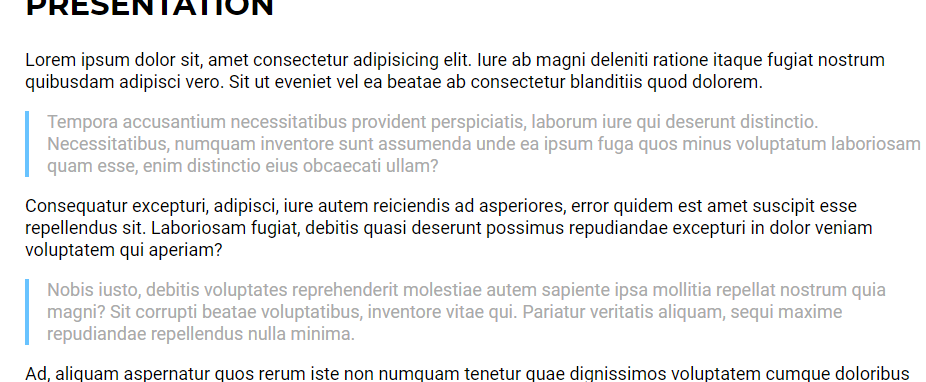

**Note : on peut définir plusieurs classes pour un élément**.

En effet, il serait aussi possible de définir plusieurs classes pour cumuler plusieurs styles, ou bien dériver un style.

Reprenons l'exemple de nos citations.

Si je souhaite créer un nouveau type de citation qui a une couleur de bordure différente (à gauche), alors je peux conserver le style de base d'une citation dans une classe `quote`, puis créer des classes spécifiques pour la couleur voulue :

> CSS

```css
.quote {
  color: #aaa;
  padding-left: 1em;
  /* Je définis une bordure de base, appliquée pour une citation */
  border-left: 4px solid #000;
}

.quote-blue {
  /* Si j'applique cette classe, la bordure passera en bleu */
  border-left-color: #68c3ff;
}

.quote-red {
  /* Et ici, en rouge */
  border-left-color: #ff4d4d;
}
```

Ensuite, je peux appliquer ces styles sur les éléments HTML voulus :

```html
<p>Lorem ipsum dolor sit</p>
<!-- J'inscris plusieurs classes -->
<p class="quote quote-blue">Tempora accusantium necessitatibus</p>
<p>Consequatur excepturi</p>
<p class="quote quote-red">Nobis iusto, debitis voluptates</p>
<p>
  Ad, aliquam aspernatur quos rerum iste non numquam tenetur quae dignissimos
  voluptatem cumque doloribus corrupti sequi unde eaque ullam!
</p>
<p class="quote">Ad, aliquam aspernatur</p>
```

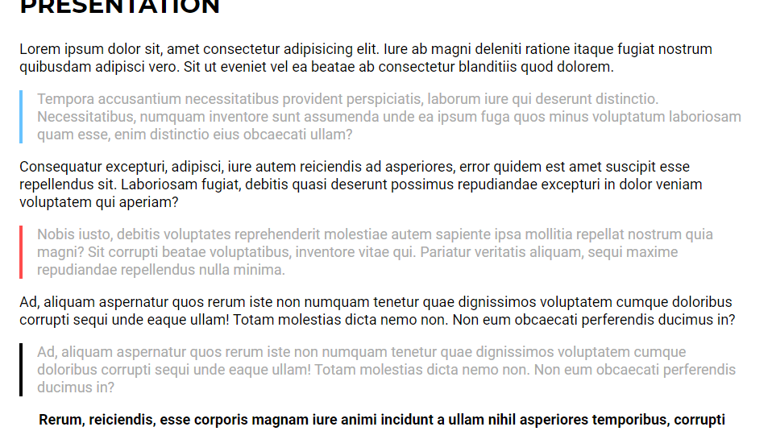

### Flexbox

Le modèle Flexbox, appliqué à un élément, permet de contrôler la manière dont vont être distribués ses enfants (horizontalement, verticalement).

Exemple :

Je dispose d'un menu avec ma balise `nav`, contenant une liste non ordonnée `ul` de liens.

Par défaut, ma liste s'affiche **verticalement**, les éléments sont les uns en-dessous des autres.

Une solution possible pour rendre mon menu **horizontal**, est d'appliquer le modèle Flexbox à la balise `ul`. Ainsi, nous allons pouvoir configurer la distribution des `li` qu'elle contient.

L'application du modèle Flexbox s'effectue par la propriété `display` :

```css
#main-menu ul {
  list-style-type: none;
  margin: 0;
  padding: 0;
  /* Application Flexbox */
  display: flex;
  /* Comment distribuer les enfants ? Ici, horizontalement (row = ligne) */
  flex-direction: row;
  /* Comment aligner les enfants horizontalement ? */
  justify-content: space-evenly;
}
```

> Nous n'avons pas eu à spécifier de règle supplémentaire pour les éléments `li` contenus dans la liste

### Marges, bordures

Tout élément HTML, dans un navigateur, va être constitué de différentes parties. De l'intérieur vers l'extérieur :

- Le contenu
- Les marges intérieures (`padding`)
- Les bordures (`border`)
- Les marges extérieures (`margin`)

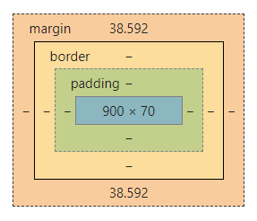

Ainsi, il est possible d'agir sur ces différentes parties via des règles CSS.

> Chaque élément possède 4 côtés (top, left, bottom, right). Les règles CSS que nous allons voir sont donc extensibles à chacun de ces côtés

#### Contenu

Pour agir sur le contenu, nous avons déjà exploré quelques règles CSS : `font-size`, `color`, etc...ce sont ces règles qui vont changer l'apparence des contenus.

#### Marges intérieures (`padding`)

Il est possible d'augmenter ou diminuer les marges intérieures d'un élément avec la propriété `padding`.

Agir sur cette marge peut être utile pour aérer les contenus. Si j'ai fixé une couleur d'arrière-plan pour mon élément, alors augmenter les marges intérieures va me permettre d'espacer mes contenus de la bordure.

On peut utiliser `padding` pour fixer une marge intérieure qui s'appliquera à tous les côtés, sinon on peut utiliser `padding-top`, `padding-left`, `padding-bottom` et `padding-right` pour fixer la marge intérieure d'un côté uniquement.

```css
#main-menu {
  /* ... */
  padding-top: 1em;
  padding-bottom: 1em;
  /* ... */
}
```


#### Bordures (`border`)

Les bordures permettent d'encadrer un élément. La règle `border` permet de fixer une bordure. On retrouvera donc les règles `border-top`, `border-left`, `border-bottom` et `border-right` pour ajouter une bordure d'un seul côté.

Nous avons utilisé la règle `border` pour construire notre classe **quote** :

```css
.quote {
  /* ... */
  border-left: 4px solid #000;
}
```

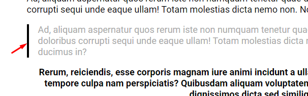

#### Marge extérieures (`margin`)

Les marges extérieures sont utiles pour espacer les éléments HTML. Elles nous aident également à aérer nos contenus.

Elles peuvent également nous aider à ajuster les styles par défaut appliqués par le navigateur, par exemple sur l'élément racine `body`.

En effet, avec Google Chrome par exemple, quand nous construisons une page, l'élément `body` a automatiquement un `margin` appliqué par le navigateur, pour éviter que les contenus ne soient collés au bord de la page :

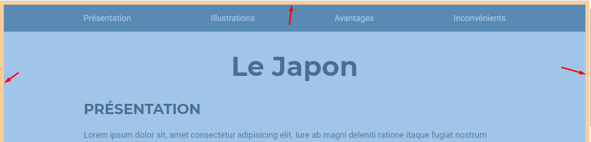

Nous pouvons corriger cet affichage en appliquant la valeur `0` à toutes les marges extérieures :

```css
body {
  margin: 0;
}
```

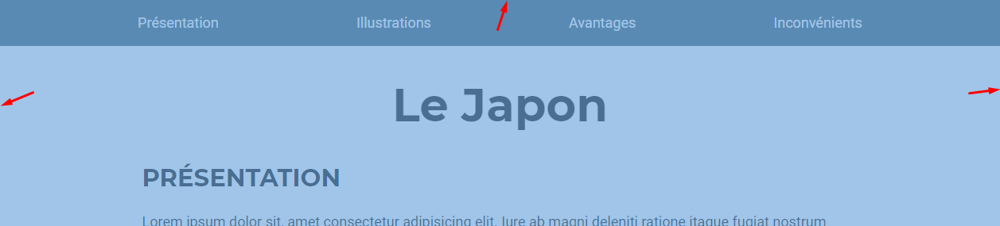

Il ne faut pas oublier l'intérêt des marges extérieures pour aérer les contenus, par exemple pour un titre principal :

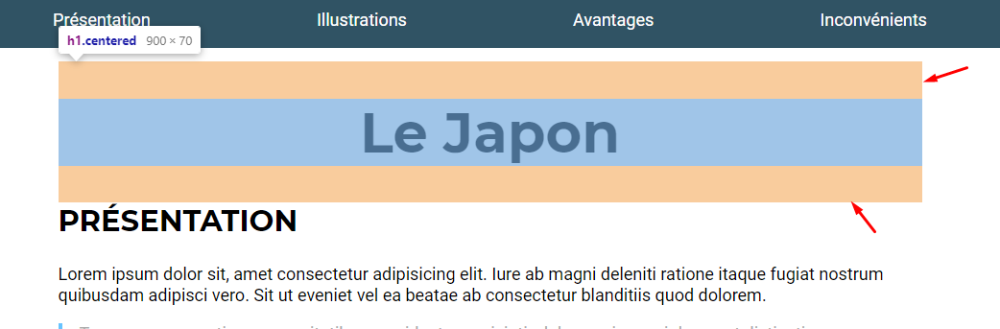

### Positionnement

Chaque élément HTML a une un **positionnement** dans la page.

Le positionnement par défaut est **static**. Cela signifie simplement que tous les éléments vont s'afficher les uns après les autres.

Il est possible d'ajuster la manière dont un élément doit être positionné avec la règle `position`.

Par exemple, si je souhaite que mon menu reste "collé" en haut de page, je peux lui appliquer le positionnement `fixed` :

```css
#main-menu {
  /* ... */
  position: fixed;
  /* ... */
}
```

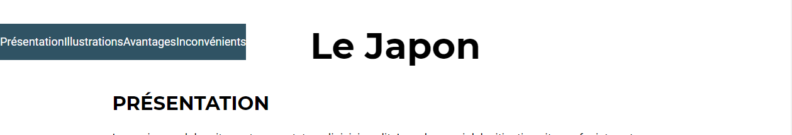

Quand on applique le positionnement `fixed` à un élément, il est nécessaire d'utiliser d'autres règles CSS pour indiquer précisément au navigateur la manière dont on souhaite afficher l'élément.

Pour notre menu, en l'occurence, on souhaite qu'il occupe toute la largeur de la page, et qu'il soit situé tout en haut de la page, comme "collé".

Il faut donc ajouter les règles `width` (largeur) et `top` (distance avec le haut) avec les valeurs adéquates :

```css
#main-menu {
  /* ... */
  position: fixed;
  /* Pour qu'il occupe 100% de la largeur */
  width: 100%;
  /* Pour qu'il soit à une distance de 0 du haut, donc collé */
  top: 0;
  /* ... */
}
```

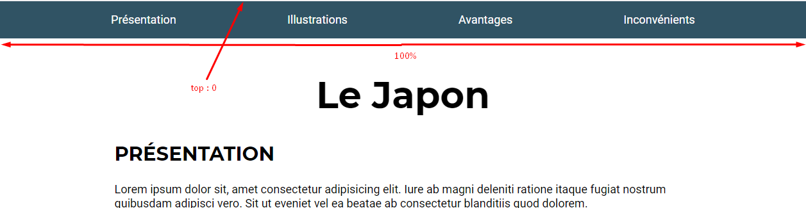

### Contrôler la largeur des contenus, centrer les contenus

Par défaut, nos contenus vont occuper toute la largeur de la page.

Ce n'est pas la meilleure option pour le confort de lecture des utilisateurs. Les lignes seraient trop longues à parcourir.

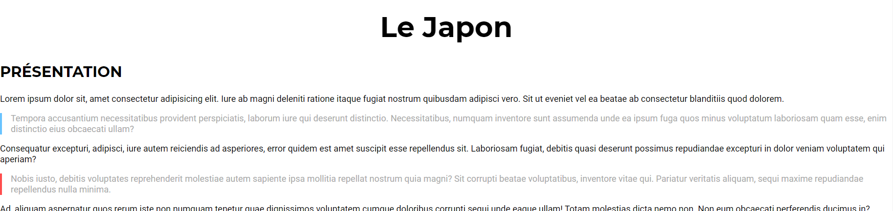

Pour contrôler la largeur des contenus, une option possible est de les englober dans une balise, dont nous allons ensuite limiter la largeur, et centrer.

> Jusqu'à présent, les balises que nous avons vues avaient toutes un rôle, un but particulier. Par exemple, `a` permet de faire un lien hypertexte, `p` un paragraphe, `h1` un titre de premier niveau, etc...Ici, nous voulons englober nos contenus, donc nous avons besoin d'une balise plus **généraliste**. En HTML, la balise correspondant à ce besoin est `div`. Elle va nous aider à **diviser** nos contenus en différentes parties, pour pouvoir les styliser ensuite selon nos besoins, sans qu'elle ait une signification aussi forte qu'un titre, un paragraphe, une navigation, etc...

```html
<!-- ... -->
<body>
  <!-- ... -->
  <div id="content">
    <!-- ... -->
  </div>
  <!-- ... -->
</body>
<!-- ... -->
```

La balise `div` avec l'id "content" va donc contenir des éléments ayant une signification plus forte : les différentes sections de notre page.

Dans notre fichier CSS, nous pouvons indiquer une largeur à notre zone de contenu avec la règle `width`. Nous pouvons également lui indiquer une **largeur maximale** avec `max-width`, ce qui nous permettra aux contenus de s'adapter à des écrans plus petits.

Enfin, pour centrer notre conteneur, nous pouvons utiliser la propriété `margin` avec la valeur `auto`.

```css
#content {
  /*
  Largeur maximale : 900px
  Si on est en-dessous de 900px, le texte reviendra à la ligne et s'adaptera
  */
  max-width: 900px;
  /*
  margin: auto nous permet de centrer l'élément
  => les marges extérieures sont calculées automatiquement
  */
  margin: auto;
}
```

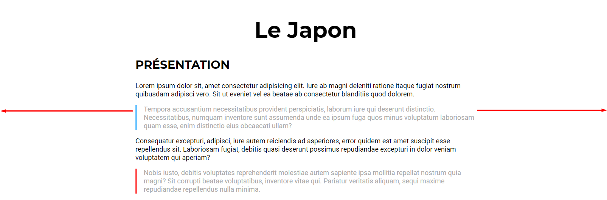

### L'unité de mesure relative

Pour spécifier des tailles en CSS, nous avons souvent utilisé l'unité de mesure `px`, le pixel.

Il peut être intéressant d'utiliser cette unité. Cependant, il s'agit d'une unité **absolue**. Si nous n'indiquons que des valeurs absolues dans notre fichier CSS, il peut devenir compliqué, sur le long terme, de mettre à jour les styles et que tous les éléments gardent la même échelle de taille entre eux.

C'est pourquoi nous allons préférer l'utilisation d'unités de mesure **relatives**, quand c'est possible.

L'idée est simple : être en mesure de spécifier des valeurs **relatives** pour nos tailles de police, de marges, de largeur, etc...dès que possible, nous permettra de mettre à jour nos styles plus rapidement et plus efficacement dès qu'on en aura besoin.

> Cela ne signifie pas qu'il faut arrêter d'utiliser `px`. Quelquefois nous aurons besoin de spécifier une taille fixe, en pixels (une taille de bordure par exemple)

Prenons l'exemple de la taille de police. Un navigateur applique une taille de police par défaut pour les contenus (Google Chrome : 16px par exemple).

L'unité de mesure `em` nous permet d'exprimer nos tailles de police **relativement** à l'élément parent le plus proche spécifiant une taille.

Si nous n'avons spécifié aucune taille de police dans notre fichier, alors les tailles de police exprimées en `em` se baseront sur cette taille de base de 16px.

Sinon, nous pouvons décider d'indiquer au navigateur une taille de base (en pixels) dans notre élément racine `body`, par exemple :

```css
body {
  font-size: 18px;
}
```

Puis, pour nos titres de premier niveau, une taille relative :

```css
h1 {
  /* On peut utiliser des nombres décimaux pour être plus précis */
  font-size: 3.2em;
}
```

Ainsi :

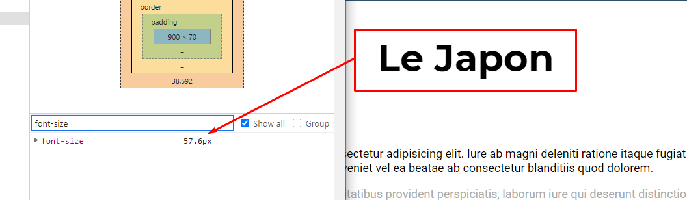

La taille de la police calculée par le navigateur est donc `18 * 3.2 = 57.6px`.

> Si vous voulez baser les tailles de certains éléments sur la taille "initiale" du navigateur, c'est-à-dire 16px, il est possible d'utiliser `rem` à la place de `em`. Le `r` signifie `root`, donc on dit au navigateur de baser son calcul sur la taille racine

## Les formulaires

La balise de formulaire en HTML est `<form></form>`.

Entre ces balises, vous allez pouvoir intégrer différents champs de formulaire.

Egalement, on pourra accompagner les champs d'un formulaire de libellés.

### Champs de formulaire

La balise principalement utilisée pour afficher un champ de formulaire est la balise `<input />` (auto-fermante).

A l'aide de l'attribut `type`, on peut indiquer au navigateur le type de données attendu. Par exemple `text`, `email`, `password`, etc...

```html
<form>
  <input type="text" />
  <input type="email" />
</form>
```

> Dans Visual Studio Code, l'autocomplétion devrait suggérer tous les types disponibles automatiquement à l'ouverture des guillemets derrière l'attribut `type`

Si on veut afficher une zone de texte plus grande, pour saisir un message ayant davantage de contenu qu'un simple nom ou prénom par exemple, on peut utiliser la balise `<textarea></textarea>`.

Dans ce cas, on pourra également spécifier un nombre de colonnes et un nombre de lignes pour afficher une zone plus ou moins grande/large.

#### Boutons

Pour valider un formulaire, il nous faut un bouton.

Pour afficher un bouton de soumission dans notre page, on a 2 options :

- `input` avec type submit
- `button` avec type submit

```html
<form>
  <input type="text" />
  <input type="email" />
  <!-- ... -->
  <!-- Avec input : libellé du bouton dans l'attribut 'value' -->
  <input type="submit" value="Valider" />
  <!-- Avec button : libellé du bouton entre les balises ouvrante et fermante -->
  <button type="submit">Valider</button>
</form>
```

> Dans les 2 cas, on voit bien qu'il est nécessaire de spécifier le type du bouton

---

> On rappelle que la balise `input` est autofermante, tandis que la balise `button` est double

### Libellés

Un champ seul ne sert pas à grand-chose. Il est préférable d'indiquer à l'utilisateur la donnée concernée pour chaque champ.

On peut utiliser les libellés pour cela, à l'aide de la balise `<label></label>`
.

Un libellé est défini **pour** un champ de formulaire avec l'attribut `for`. La valeur de cet attribut désigne un **id** de champ de formulaire :

```html
<!-- Le libellé désigne "nomInput", ID du champ nom -->
<form>
  <label for="nomInput">Nom :</label>
  <input type="text" id="nomInput" />
</form>
```

### Styles

Pour enlever le rectangle noir qui s'affiche autour d'un élément quand on clique dessus, on peut utiliser la règle CSS `outline` et fixer sa valeur à `none` :

```css
input,
textarea,
button {
  outline: none;
}
```

## Pseudo-classes

Chaque élément dispose de **pseudo-classes**.

Chaque pseudo-classe est appliquée sur l'élément dans un contexte particulier.

Exemple : la pseudo-classe `hover` est appliquée sur un élément quand on passe la souris dessus.

On peut donc décider de styliser notre élément différemment en fonction du contexte.

Syntaxe : `selecteur:hover {}`

```css
/* Au passage de la souris sur un button, l'arrière-plan deviendra blanc */
button:hover {
  background-color: #fff;
}
```

> On peut aussi utiliser la pseudo-classe `active` pour styliser un élément quand on est en train de cliquer dessus (et que le clic n'a pas encore été relâché)

## Transitions

On peut allier l'utilisation des pseudo-classes à celle des **transitions**.

Les transitions permettent de passer d'un état à un autre (exemple, l'arrière-plan de notre `button:hover` un peu plus haut), mais de manière fluide.

Pour ça, on va utiliser la règle CSS `transition`, avec la syntaxe suivante :

```css
button {
  /*
  Syntaxe :
  - propriété sur laquelle appliquer la transition
  - durée (en secondes (s) ou millisecondes (ms))
  - type de transition
  */
  transition: background-color 0.2s ease-in-out;
}

button:hover {
  background-color: #fff;
}
```

Ainsi, le passage d'un état à un autre se fait de manière fluide.

> Pour appliquer une transition sur toutes les propriétés de l'élément, utiliser `all` en tant que nom de propriété

## Les éléments inline & block

Un élément HTML possède un positionnement dans la page, nous l'avons vu précédemment.

Il possède également un type d'affichage : `inline`, `block` ou `inline-block`.

### Les éléments block

Un élément block se situera sur une nouvelle ligne à l'écran, et occupera tout l'espace horizontal disponible. Il va donc repousser la balise qui suit sur une nouvelle ligne

Exemple : `div`, `p`, `form`...

### Les éléments inline

Un élément inline, quant à lui, ne s'affiche pas nécessairement sur une nouvelle ligne (à moins qu'il y soit poussé par un élément `block` qui le précède). Par ailleurs, il va occuper seulement l'espace horizontal nécessaire à son affichage.

Exemple : `a`, `img`...

> Il existe aussi des éléments de type `inline-block`. Pour l'instant nous les retiendrons essentiellement comme des éléments de type inline

## Responsive Web Design (RWD)

Il est aujourd'hui nécessaire qu'un site web puisse s'afficher correctement sur n'importe quel type de terminal (ordinateur, tablette, téléphone, etc...).

En CSS, il est possible de définir des règles d'affichage spécifique en fonction du terminal et d'autres règles.

> Le plus couramment, nous allons définir des règles d'affichage pour les terminaux disposant d'écrans, et pour une règle concernant une largeur maximale

Ceci nous permet donc d'affiner l'affichage de notre site en fonction du terminal sur lequel il est consulté.

Mais au préalable, il est nécessaire de spécifier le **viewport**.

### viewport

Le viewport permet d'indiquer au navigateur la largeur à appliquer et le niveau de zoom initial.

On le spécifie grâce à une balise `meta` dans le `head` de la page :

```html
<meta name="viewport" content="width=device-width, initial-scale=1.0" />
```

Grâce à cette balise, on peut déjà régler pas mal de problème d'affichage.

Cependant, il peut être nécessaire d'affiner et ajuster nos styles selon certains cas.

Pour effectuer ces ajustements, on va utiliser des **media queries**.

### Media queries

Les media queries sont l'outil qui nous permet de déclarer des règles spécifiques suivant le contexte.

Syntaxe : `@media [type de media] [critere(s)] {}`

> Entre les accolades, on va définir ou redéfinir les règles nécessaires à un affichage correct pour le contexte ciblé. **On définit ou redéfinit donc des règles CSS à l'intérieur d'une media query**

```css
/* On cible les terminaux disposant d'un écran et ayant une largeur inférieure à 450px */
@media screen and (max-width: 450px) {
  /* On passe la taille des titres de premier niveau à 3.5em */
  h1 {
    font-size: 3.5em;
  }

  /*
  On ajoute des marges extérieures de 15px, sur les côtés,
  pour éviter que les contenus soient collés au bor de l'écran
  */
  #content {
    margin-left: 15px;
    margin-right: 15px;
  }
}
```

> On peut donc déclarer plusieurs media queries dans un document CSS, pour adapter au "cas par cas" l'affichage voulu
